# 🚀 DevOps Study Roadmap


This repository provides a comprehensive, structured learning path for DevOps practices, designed for beginners to advance to expert level. The roadmap covers essential concepts, tools, principles, and best practices through a curated sequence of topics, with detailed course outlines in each folder.

## 📋 Learning Roadmap

### 📚 Beginner Level
1. 💡 Understand the DevOps Culture
2. 🔧 Grasp Core DevOps Principles

### 🛠️ Core DevOps Tools
3. 📦 Git (Version Control Systems)
4. 🔄 Jenkins (Continuous Integration)
5. 🐳 Docker (Containerisation Basics)
6. ☸️ Kubernetes (Container Orchestration)
7. ⚙️ Ansible (Software Configuration Management)
8. 🛠️ Puppet (Infrastructure as Code)

### 📋 DevOps Practices
9. 📤 Continuous Delivery Fundamentals
10. 🔄 Blue-Green Deployments
11. 📊 Prometheus (Infrastructure Monitoring)
12. 🔍 Elasticsearch (Log Management)
13. 🔒 Security and Compliance Basics
14. 💻 Bash/Python (Scripting Automation)

### ☁️ Cloud & Infrastructure
15. 🏗️ Terraform (Infrastructure Provisioning)
16. ☁️ AWS, Azure, or Google Cloud Platform (Cloud Platforms)

### 🎯 Advanced Topics
17. ⚡ Performance Tuning and Benchmarking
18. 🛡️ Disaster Recovery Strategies
19. 🚀 Continuous Deployment Best Practices
20. 🌐 Istio (Service Mesh Architectures)
21. ⚡ Serverless Architectures in DevOps
22. 🔄 Continuous Improvement & Learning (DevOps Culture Revisited)

## 📊 Visual Roadmap

```mermaid
flowchart TD
    Start[🚀 Start] --> Culture[1. Understand DevOps Culture<br/>2. Core DevOps Principles]
    Culture --> VCS[3. Git<br/>Version Control]
    VCS --> CI[4. Jenkins<br/>Continuous Integration]
    CI --> Container[5. Docker<br/>6. Kubernetes<br/>Containers & Orchestration]
    Container --> IaC[7. Ansible<br/>8. Puppet<br/>Configuration Management]
    IaC --> CD[9. Continuous Delivery<br/>10. Blue-Green Deployments]
    CD --> Monitoring[11. Prometheus<br/>12. Elasticsearch<br/>Monitoring & Logging]
    Monitoring --> Security[13. Security and Compliance<br/>14. Bash/Python<br/>Scripting]
    Security --> Infra[15. Terraform<br/>16. Cloud Platforms<br/>Infrastructure as Code]
    Infra --> Advanced[17. Performance Tuning<br/>18. Disaster Recovery<br/>19. Continuous Deployment]
    Advanced --> Modern[20. Istio<br/>21. Serverless<br/>22. Continuous Improvement]
    Modern --> End[🎯 Expert Level]
```



## 📚 Course Outlines

Each numbered folder contains a detailed course outline with modules, topics, and hands-on projects. Here's the current status:

| Folder | Topic | Course Outline | Status |
|--------|-------|---------------|--------|
| 02 Git/ | Git (Version Control Systems) | [git.md](./02%20Git/git.md) | ✅ Complete |
| 03 Jenkins/ | Jenkins (Continuous Integration) | [jenkins.md](./03%20Jenkins/jenkins.md) | ✅ Complete |
| 04 Ansible/ | Ansible (Software Configuration Management) | [ansible.md](./04%20Ansible/ansible.md) | ✅ Complete |
| 05 Puppet/ | Puppet (Infrastructure as Code) | [puppet.md](./05%20Puppet/puppet.md) | ✅ Complete |
| 06 Docker/ | Docker (Containerisation Basics) | [docker.md](./06%20Docker/docker.md) | ✅ Complete |
| 07 K8S/ | Kubernetes (Container Orchestration) | [kubernetes.md](./07%20K8S/kubernetes.md) | ✅ Complete |
| 08 continuous delivery/ | Continuous Delivery Fundamentals | [continuous_delivery.md](./08%20continuous%20delivery/continuous_delivery.md) | ✅ Complete |
| 09 Blue-Green Deployments/ | Blue-Green Deployments | [blue_green.md](./09%20Blue-Green%20Deployments/blue_green.md) | ✅ Complete |
| 10 Prometheus/ | Prometheus (Infrastructure Monitoring) | [prometheus.md](./10%20Prometheus/prometheus.md) | ✅ Complete |
| 11 Elasticsearch/ | Elasticsearch (Log Management) | [elasticsearch.md](./11%20Elasticsearch/elasticsearch.md) | ✅ Complete |
| 12 Security and Compliance Basics/ | Security and Compliance Basics | [Security_and_Compliance.md](./12%20Security%20and%20Compliance%20Basics/Security_and_Compliance.md) | ✅ Complete |
| 13 Bash/ | Bash (Scripting Automation) | [bash.md](./13%20Bash/bash.md) | ✅ Complete |
| 14 Python/ | Python (Scripting Automation) | [python.md](./14%20Python/python.md) | ✅ Complete |
| 15 Terraform/ | Terraform (Infrastructure Provisioning) | [terraform.md](./15%20Terraform/terraform.md) | ✅ Complete |
| 16 AWS/ | AWS (Cloud Platforms) | [aws.md](./16%20AWS/aws.md) | ✅ Complete |
| 17 Azure/ | Azure (Cloud Platforms) | [azure.md](./17%20Azure/azure.md) | ✅ Complete |
| 18 Google Cloud Platform | Google Cloud Platform (Cloud Platforms) | [File: 18 Google Cloud Platform](./18%20Google%20Cloud%20Platform) | 📝 Needs Outline |
| 19 security and compliance basic/ | Security and Compliance Basics (Advanced) | [security_compliance.md](./19%20security%20and%20compliance%20basic/security_compliance.md) | ✅ Complete |
| 20 Disaster Recovery Strategies/ | Disaster Recovery Strategies | [disaster_recovery.md](./20%20Disaster%20Recovery%20Strategies/disaster_recovery.md) | ✅ Complete |
| 21 Continuous Deployment Best Practices/ | Continuous Deployment Best Practices | [continuous_deployment.md](./21%20Continuous%20Deployment%20Best%20Practices/continuous_deployment.md) | ✅ Complete |
| 23 Istio (Service Mesh Architectures)/ | Istio (Service Mesh Architectures) | [istio.md](./23%20Istio%20(Service%20Mesh%20Architectures)/istio.md) | ✅ Complete |
| 24 Serverless Architectures in DevOps/ | Serverless Architectures in DevOps | [gcp.md](./24%20Serverless%20Architectures%20in%20DevOps/gcp.md) | ✅ Complete |

## 📖 How to Use This Roadmap

1. **Start with Foundations**: Begin with topics 1-2 to understand DevOps culture and principles
2. **Follow the Sequence**: Study topics in numerical order for logical progression
3. **Deep Dive**: Each folder contains a comprehensive course outline with modules and practical projects
4. **Practice Hands-On**: Use the provided modules to guide your learning and implementation
5. **Iterate**: Return to earlier topics as you gain experience (topic 22 emphasizes continuous learning)

## 🛠️ Prerequisites

- Basic computer literacy
- Familiarity with command-line interfaces
- Understanding of software development concepts
- Access to a computer with internet connectivity

## 📚 Recommended Resources

- **Official Documentation**: Always refer to official docs for the latest information
- **Online Courses**: Platforms like Udemy, Coursera, Pluralsight, and Linux Academy
- **Practice Platforms**: GitHub, Docker Hub, Kubernetes playgrounds
- **Communities**: DevOps-focused subreddits, Stack Overflow, DevOps-focused Slack/Discord groups
- **Books**: "The Phoenix Project", "DevOps Handbook", "Site Reliability Engineering"

## 🤝 Contributing

We welcome contributions! Here's how you can help:

- **Add Content**: Create outlines for missing topics or improve existing ones
- **Fix Issues**: Report bugs or suggest improvements
- **Share Knowledge**: Contribute best practices or real-world examples
- **Review**: Help review pull requests and provide feedback

### Contribution Guidelines

1. Fork the repository
2. Create a feature branch (`git checkout -b feature/amazing-feature`)
3. Commit your changes (`git commit -m 'Add amazing feature'`)
4. Push to the branch (`git push origin feature/amazing-feature`)
5. Open a Pull Request

## 📄 Project Structure

```
/Devops_study/Roadmap/
├── README.md                          # This file
├── roadmap.txt                        # Visual roadmap in Markdown
├── 02 Git/                            # Git course outline
├── 03 Jenkins/                        # Jenkins course outline
├── ...                                # Other topic folders
└── 24 Serverless Architectures in DevOps/  # Latest topic
```

## 📈 Progress Tracking

Track your DevOps learning journey by checking off completed topics and noting your hands-on projects.

## 📞 Support

If you have questions or need clarification on any topic:
- Open an issue in this repository
- Join DevOps communities for peer support
- Consult official documentation

## 📄 License

This project is licensed under the MIT License - see the [LICENSE](LICENSE) file for details.

---

**Happy Learning! 🎉**

*Master DevOps one topic at a time with this comprehensive roadmap.*
